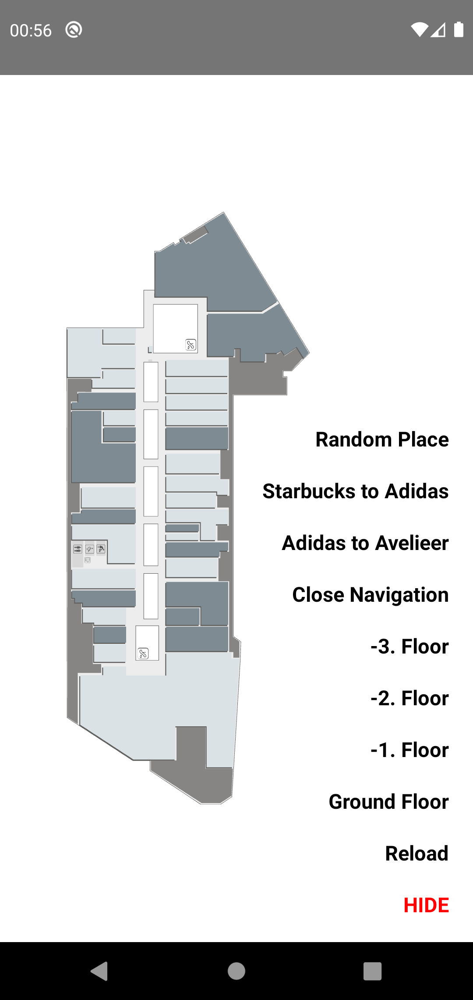

# react-native-mechanic-map

[](https://npmjs.com/package/react-native-mechanic-map)
[](https://npmjs.com/package/react-native-mechanic-map)
[](https://circleci.com/gh/ridvanaltun/react-native-mechanic-map/tree/master)
[](https://github.com/ridvanaltun/react-native-mechanic-map/blob/master/LICENSE)

> React Native wrapper for Mechanic Map

## Getting started

```sh
npm install react-native-mechanic-map
```

**Dependencies**

This library needs these dependencies to be installed in your project before you can use it:

```sh
npm install react-native-webview
```

> **_Check [react-native-webview](https://github.com/react-native-webview/react-native-webview) installation guide._**

### Additional installation steps

#### Android

Edit `android/app/build.gradle` ( NOT `android/build.gradle` ) and add the following:

```groovy
apply from: "../../node_modules/react-native-mechanic-map/maps.gradle"
```

#### iOS

This module does not require any extra step.

## Usage

```js
import * as React from 'react';
import MechanicMap from 'react-native-mechanic-map';

// ..

const App = () => {
  const mechanicMapRef = React.useRef(null);

  return (
    <MechanicMap
      ref={mechanicMapRef}
      languageCode="en"
      payload={Payload}
      options={{
        rotate: 90,
        initialScaleFactor: 1.25,
      }}
      style={styles.container}
      onMapLoaded={() => {
        // execute when map loaded
      }}
      onLevelSwitched={(newLevel) => {
        // execute when floor switched
      }}
      onLocationOpened={(target) => {
        // executes when any location opened
      }}
    />
  );
};
```

Select floor:

```js
mechanicMapRef?.current?.setFloor(floorNo);
```

Reload:

```js
mechanicMapRef?.current?.reload();
```

Show navigation:

```js
mechanicMapRef?.current?.showNavigation({ route });
```

Close navigation:

```js
mechanicMapRef?.current?.closeNavigation();
```

Show location:

```js
mechanicMapRef?.current?.showLocation({ id, type });
```

## Example App



```sh
# clone the project
git clone https://github.com/ridvanaltun/react-native-mechanic-map.git

# go into the example folder
cd react-native-mechanic-map/example

# install dependencies
npm i

# run for android
npm run android

# or

# install pods for ios
cd ios && pod install && cd ..

# run for ios
npm run ios
```

## Contributing

See the [contributing guide](CONTRIBUTING.md) to learn how to contribute to the repository and the development workflow.

## License

MIT
