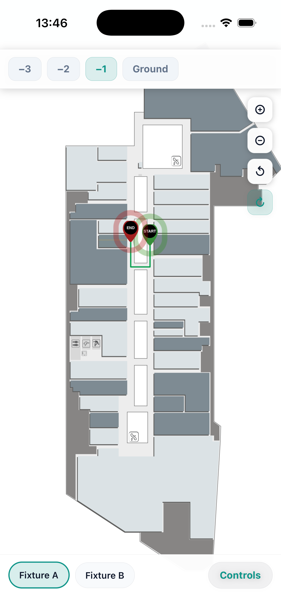
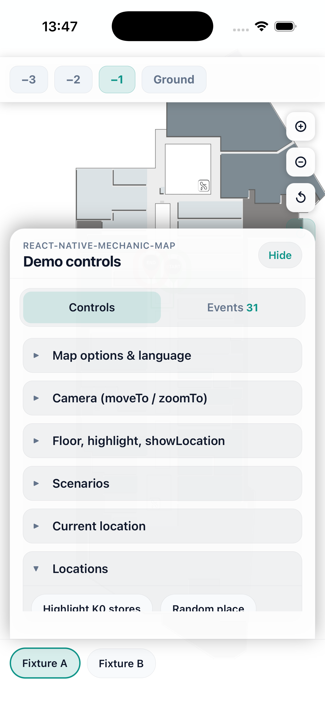
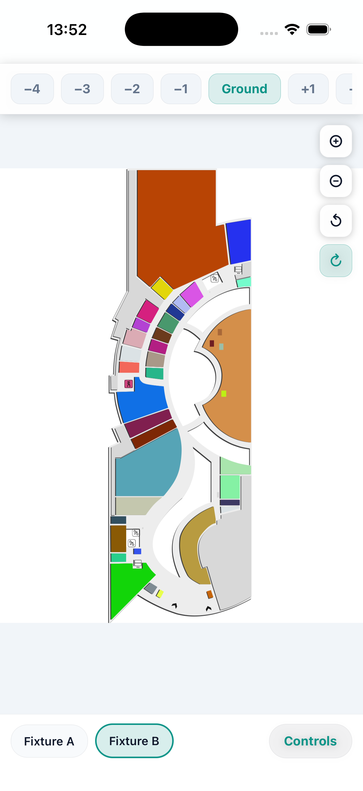

# react-native-mechanic-map <!-- omit in toc -->

[](https://npmjs.com/package/react-native-mechanic-map)
[](https://circleci.com/gh/ridvanaltun/react-native-mechanic-map/tree/master)
[](http://commitizen.github.io/cz-cli/)
[](https://github.com/ridvanaltun/react-native-mechanic-map/blob/master/LICENSE)

> React Native WebView wrapper for Mechanic Map: interactive floors, navigation, highlights, and imperative APIs from JavaScript.

## Showcase

<p align="center">
  
  
  
</p>

<p align="center">
  <em>Screenshots from the <a href="#example-app">example app</a> — open the action menu to try navigation, floors, and highlights.</em>
</p>

## Table of contents <!-- omit in toc -->

- [Showcase](#showcase)
- [Requirements](#requirements)
- [Installation](#installation)
- [Native setup](#native-setup)
  - [Android](#android)
  - [iOS](#ios)
- [Usage](#usage)
  - [Quick start](#quick-start)
  - [Props](#props)
  - [Events](#events)
  - [Imperative API](#imperative-api)
- [Types](#types)
  - [MechanicMapOptions](#mechanicmapoptions)
- [Example app](#example-app)
- [Contributing](#contributing)
- [License](#license)

## Requirements

- [React Native](https://reactnative.dev/)
- [react-native-webview](https://github.com/react-native-webview/react-native-webview) **≥ 9** (peer dependency; follow its [install guide](https://github.com/react-native-webview/react-native-webview/blob/master/docs/Guide.md) for your RN version)

## Installation

```sh
npm install react-native-mechanic-map
```

## Native setup

### Android

In **`android/app/build.gradle`** (not the root `android/build.gradle`), add:

```groovy
apply from: "../../node_modules/react-native-mechanic-map/react.gradle"
```

Rebuild the app. This wires the bundled HTML asset the WebView loads.

### iOS

No extra steps beyond `react-native-webview` setup.

## Usage

### Quick start

`payload` is an array of [`MechanicMapPayload`](#types) (floors: size, SVG map, locations). The map auto-initializes when the WebView finishes loading unless you set `disableAutoInit` and call `ref.current?.init(...)` yourself.

```tsx
import * as React from 'react';
import MechanicMap, {
  type MechanicMapHandle,
  type MechanicMapPayload,
} from 'react-native-mechanic-map';

const levels: MechanicMapPayload[] = [
  /* id, no, mapWidth, mapHeight, title, map (SVG), locations */
];

const App = () => {
  const mapRef = React.useRef<MechanicMapHandle>(null);

  return (
    <MechanicMap
      ref={mapRef}
      languageCode="en"
      payload={levels}
      options={{
        rotate: 90,
        initialScaleFactor: 1.25,
      }}
      onMapLoaded={() => {
        mapRef.current?.setFloor(0);
      }}
      onLevelSwitched={(level) => {}}
      onLocationOpened={(location) => {}}
      onLocationClosed={() => {}}
      onNavigationCancelled={() => {}}
      onLocationHighlighted={() => {}}
      onMapError={(data) => {}}
    />
  );
};
```

All [`WebView` props](https://github.com/react-native-webview/react-native-webview/blob/master/docs/Reference.md) are supported and forwarded. `onMapError` also receives bridge/WebView failures (bad messages, load/HTTP errors, Android render-process loss) in addition to map script errors.

### Props

| Prop | Description |
| --- | --- |
| `payload` | `MechanicMapPayload[]` — levels to show |
| `languageCode` | Map language (default `en`) |
| `options` | `MechanicMapOptions` — rotation, zoom, tooltips, colors, etc. |
| `disableAutoInit` | If `true`, skip auto `INIT`; call `ref.current.init({ payload, options, languageCode })` |
| `onEvent` | Optional catch-all: discriminated union of all map → RN events |
| `onMapLoaded`, `onLevelSwitched`, … | See [Events](#events) |
| `onMapError` | Script errors and WebView/bridge failures (`MapScriptErrorData`) |

Tooltip props (optional): `onTooltipNavigationClick`, `onTooltipDetailClick`, `onTooltipEnterBuildingClick`, `onTooltipCloseClick`.

### Events

| Callback | When |
| --- | --- |
| `onMapLoaded` | Map finished loading |
| `onLevelSwitched` | Floor changed (`LevelSwitchedData`) |
| `onLocationOpened` / `onLocationClosed` | Location panel opened/closed |
| `onLocationHighlighted` | Highlight applied |
| `onNavigationCancelled` | User cancelled navigation |
| `onMapError` | Map script or WebView/bridge error |

Use `onEvent` if you prefer a single handler with a typed `EventPayload` union.

### Imperative API

Use `React.useRef<MechanicMapHandle>(null)` and call `mapRef.current` after `onMapLoaded` (or whenever the ref is set). Signatures below match [`src/types.ts`](src/types.ts).

**Floors and lifecycle**

```ts
mapRef.current?.setFloor(1, { resetZoom: true, hideLocation: true });
mapRef.current?.addLevel(newLevel); // MechanicMapPayload — same shape as `payload[]` items
mapRef.current?.resetLevel();
mapRef.current?.reload();
mapRef.current?.init({ payload: levels, languageCode: 'en', options: {} });
```

**Navigation**

```ts
import type { Route } from 'react-native-mechanic-map';

const route = {} as Route; // from your pathfinding / backend

mapRef.current?.showNavigation(route, {
  autoMode: true,
  zoomEnabled: true,
  showPins: true,
});
mapRef.current?.closeNavigation(true);
```

Multi-floor programs, building transitions, and related helpers (mirrors the API on the embedded map instance):

```ts
import type {
  MultipleNavigationSegment,
  StartNavigationProgram,
  UpdateLocalizedParams,
} from 'react-native-mechanic-map';

const segment: MultipleNavigationSegment = {
  type: 'outdoor', // or a `building` id for your data
  navigation: route,
};

mapRef.current?.showNavigationWithMultiple([segment, { navigation: otherRoute }], {
  autoMode: false,
  zoomEnabled: true,
  showPins: true,
  groupIndex: 0,
});

const program: StartNavigationProgram = route; // or an array of `MultipleNavigationSegment`
mapRef.current?.startNavigation(program, {
  autoMode: true,
  zoomEnabled: true,
  showPins: true,
});

mapRef.current?.restartNavigation();
mapRef.current?.prevNavigate();
mapRef.current?.nextNavigate();
mapRef.current?.prevBuildingNavigate();
mapRef.current?.nextBuildingNavigate();
mapRef.current?.enterBuilding('building-id');
mapRef.current?.exitBuilding();
mapRef.current?.updateLocalized({
  youAreHereText: 'You are here',
} as UpdateLocalizedParams);
mapRef.current?.changeNavigationPins({ startPin: 'https://.../a.png' });
mapRef.current?.resetNavigationPins();
```

**Floor by level id & single highlight**

```ts
mapRef.current?.setFloorById('level-uuid', {
  resetZoom: true,
  hideLocation: true,
  autoMode: false,
  willSwitchLevel: true,
});
mapRef.current?.highlightLocation('store-id', {
  zoomEnabled: true,
  duration: 800,
});
```

**Locations**

```ts
import { LocationTypes } from 'react-native-mechanic-map';

mapRef.current?.showLocation({
  id: 'store-1',
  type: LocationTypes.STORE,
  duration: true,
  closeNavigation: true,
  moveAndZoom: true,
});
mapRef.current?.hideLocation();
mapRef.current?.highlightLocations(['id-a', 'id-b'], {
  type: LocationTypes.STORE,
  zoomEnabled: true,
  duration: 2000,
});
```

**User pin (“current location”)**

```ts
mapRef.current?.setCurrentLocation(120, 340, { floorNo: 0 });
mapRef.current?.showCurrentLocation();
mapRef.current?.moveCurrentLocation(
  [
    { x: 100, y: 200 },
    { x: 150, y: 220 },
  ],
  { floorNo: 0 }
);
mapRef.current?.removeCurrentLocation();
mapRef.current?.setCurrentLocationFromBlock('anchor-location-id');
```

**Viewport**

```ts
mapRef.current?.zoomIn();
mapRef.current?.zoomOut();
mapRef.current?.zoomTo(200, 300, { scale: 2, duration: 400, easing: 'easeOut' });
mapRef.current?.moveTo(200, 300, { scale: 1.5, duration: 300 });
```

**Appearance**

```ts
mapRef.current?.changeColors({
  activeStores: '#22c55e',
  inactiveStores: '#94a3b8',
  background: '#0f172a',
});
```

**Low-level**

```ts
import { MapActions, type PostMessagePayload } from 'react-native-mechanic-map';

const msg: PostMessagePayload = { action: MapActions.ZOOM_IN };
mapRef.current?.postMessage(msg);
```

Prefer the typed methods above; `postMessage` is for advanced or future map actions.

## Types

Exported from the package (see [`src/types.ts`](src/types.ts) / `lib/typescript`):

| Name | Role |
| --- | --- |
| `MechanicMapPayload` | One floor: `id`, `no`, `mapWidth`, `mapHeight`, `title`, `map` (SVG), `locations` |
| `MechanicMapOptions` | Passed as `options`; aligns with the embedded Mechanic Map initialization shape — see [MechanicMapOptions](#mechanicmapoptions) |
| `MechanicMapHandle` | Ref methods |
| `Route` | Navigation path for `showNavigation` |
| `Location`, `LocationTypes`, `Color`, `ColorParams` | Locations and theming |
| `MechanicMapTooltipOptions`, `MechanicMapTextOnRectMode` | Tooltip and rect-label config |
| `MultipleNavigationSegment`, `StartNavigationProgram` | Multi-leg navigation programs |
| `UpdateLocalizedParams`, `NavigateStepOptions` | Localization and nav-step options |
| `EventPayload`, `LevelSwitchedData`, … | Event typing with `onEvent` |

### MechanicMapOptions

These fields are merged into the embedded map’s runtime configuration (the same keys the bundled map script consumes on init). Use the top-level `languageCode` prop for locale as well; you can still pass `locale` here (e.g. `availableLanguages`) if needed.

**Locale & mode**

| Field | Notes |
| --- | --- |
| `locale` | `{ language?, availableLanguages? }` — unsupported `language` values fall back to the default |
| `mode` | `MapModes.DEFAULT` \| `PICKER` (selection / backend mode) |
| `locationCannotBeSelected` | Opaque value from backend when a location must not be selectable |
| `helperTexts` | e.g. `{ youAreHere: 'You are here' }` |

**Viewport, scale, rotation**

| Field | Notes |
| --- | --- |
| `rotate` | `0` \| `90` \| `180` \| `270` — non-multiples of 90 become `0` at runtime |
| `rotatable` | Rotate map content with the SVG |
| `initialScaleFactor`, `maxScale` | Initial zoom cap and max pinch scale |
| `zoomLimit` | If set, `maxScale` is derived from `parseFloat(zoomLimit)` while level data is processed |
| `animationScale` | Scales navigation path animation relative to the map |
| `height` | Container height (px) for the map element |
| `zoom`, `zoomToSelected`, `draggable` | Interaction toggles |
| `mouseWheel` | Mouse wheel zoom (mainly relevant in WebView / desktop) |

**Selectors** (CSS selectors into the SVG; defaults match the bundled plugin)

| Field |
| --- |
| `selector`, `serviceSelector`, `rectSelector`, `noPointerGroupSelector` |
| `rotatable90PathSelector`, `rotatable180PathSelector`, `rotatable270TextSelector`, `rotatable180TextSelector` |
| `rotateServices` |

**Appearance & layers**

| Field | Notes |
| --- | --- |
| `hoverTip`, `mapFill`, `landmark`, `developer` | Feature flags |
| `fillColor` | Global fill string consumed by the map script |
| `strokeOptions` | `{ width?, color? }` for navigation stroke |
| `colors` | `ColorParams` — passed through init; combine with `changeColors` for runtime updates |
| `cssAnimation`, `cssAnimationTime` | CSS transition for navigation line; time is a base duration (ms) |

**Tooltips**

`tooltip` is a `MechanicMapTooltipOptions` object:

| Field | Notes |
| --- | --- |
| `enabled` | Master switch |
| `navigation` | `true` / `false` or `{ image?, text? }` for custom nav button |
| `detail` | `true` / `false` or `{ text? }` |
| `enterBuilding` | For multi-building maps: `true` / `false` or `{ text? }` |
| `renderTemplate` | Custom tooltip HTML (`string`) or `false` (default layout) |

**Rect labels (`textOnRect`)**

Can be `true` / `false` or an object: `enabled`, `fontFamily`, `fillColor`, `fontSize`, `maxFontSize`, `minFontSize`, `mode` (`MechanicMapTextOnRectMode`: `'static'` \| `'dynamic'`), `availableModes`.

**Animation & stack mode**

| Field | Notes |
| --- | --- |
| `animation` | `mode`, `speedFactor`, `frequencyFactor`, `stackAnimation`, `debugContainer`, `availableModes`, `pointModes` |
| `stackMode` | `true` / `false` or `{ enabled?, offset?, switchFloorTime? }` (ms) — use together with `animation.stackAnimation` when stack mode is enabled |

**Other**

| Field | Notes |
| --- | --- |
| `action` | `MapActionModes` — click behavior (`tooltip`, `zoom`, …) |
| `smartip`, `beaconMode` | Smart / beacon behaviors in the embedded map |

## Example app

Screenshots in [Showcase](#showcase) are from the `example/` app. Open **Map options** for `MechanicMapOptions`, and **Floor, highlight, showLocation** for basic ref calls plus an **Extended ref API (bridge)** block (`setFloorById`, `startNavigation`, `showNavigationWithMultiple`, building helpers, etc.).

**Local library (`file:..`)**

The example pins `"react-native-mechanic-map": "file:.."` in `example/package.json`. After editing library `src/`, run `yarn prepare` at the package root so `lib/` stays current for consumers. TS paths in `example/tsconfig.json` point at `../src/index.tsx` for local types; if editors or Metro act stale, reinstall in `example/`:

```sh
cd example
npm install react-native-mechanic-map   # or: yarn add react-native-mechanic-map
```

**Run**

```sh
git clone https://github.com/ridvanaltun/react-native-mechanic-map.git
cd react-native-mechanic-map/example
npm install
npm run android
# iOS:
cd ios && pod install && cd ..
npm run ios
```

**Published npm version**

To run the example against the registry instead of the parent folder, set a semver range in `example/package.json` (e.g. `"react-native-mechanic-map": "^0.6.0"`) and `npm install` in `example/`.

## Contributing

See [CONTRIBUTING.md](CONTRIBUTING.md).

## License

MIT
