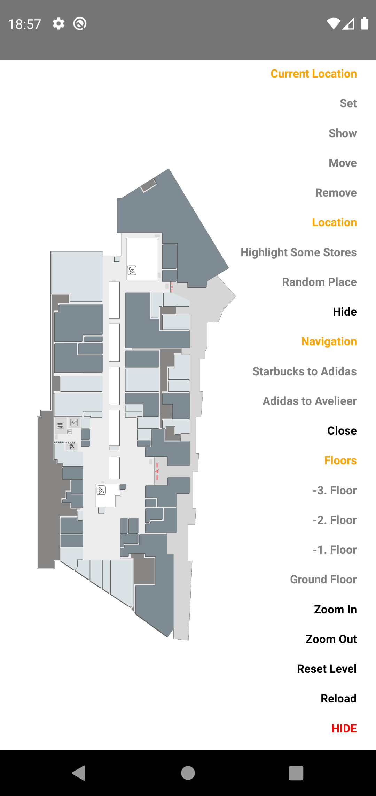

# react-native-mechanic-map <!-- omit in toc -->

[](https://npmjs.com/package/react-native-mechanic-map)
[](https://circleci.com/gh/ridvanaltun/react-native-mechanic-map/tree/master)
[](http://commitizen.github.io/cz-cli/)
[](https://github.com/ridvanaltun/react-native-mechanic-map/blob/master/LICENSE)

> React Native wrapper for Mechanic Map

# Table of Contents <!-- omit in toc -->

- [Getting started](#getting-started)
  - [Other Required Steps](#other-required-steps)
    - [Android](#android)
    - [iOS](#ios)
- [Usage](#usage)
- [Example App](#example-app)
  - [Showcase](#showcase)
- [Contributing](#contributing)
- [License](#license)

## Getting started

```sh
npm install react-native-mechanic-map
```

**Dependencies**

This library needs these dependencies to be installed in your project before you can use it:

```sh
npm install react-native-webview
```

> **_Check [react-native-webview](https://github.com/react-native-webview/react-native-webview) installation guide._**

### Other Required Steps

#### Android

Edit `android/app/build.gradle` ( NOT `android/build.gradle` ) and add the following:

```groovy
apply from: "../../node_modules/react-native-mechanic-map/react.gradle"
```

Rebuild your app.

#### iOS

This module does not require any extra step.

## Usage

```tsx
import * as React from 'react';
import MechanicMap, { MechanicMapHandle } from 'react-native-mechanic-map';

// ..

const App = () => {
  const mechanicMapRef = React.useRef<MechanicMapHandle>(null);

  return (
    <MechanicMap
      ref={mechanicMapRef}
      languageCode="en"
      payload={Payload}
      options={{
        rotate: 90,
        initialScaleFactor: 1.25,
      }}
      onMapLoaded={() => {
        // execute when map loaded
      }}
      onLevelSwitched={(newLevel) => {
        // execute when floor switched
      }}
      onLocationOpened={(target) => {
        // executes when any location opened
      }}
      onLocationClosed={() => {
        // executes when any location closed
      }}
      onNavigationCancalled={() => {
        // executes when navigation cancalled
      }}
      onLocationHighlighted={(target) => {
        // executes when location highlighted
      }}
      onMapError={(data) => {
        // executes when occours error on mechanic map
      }}
    />
  );
};
```

**Select Floor:**

```tsx
mechanicMapRef?.current?.setFloor(floorNo: Number) => void;
```

**Navigation:**

```tsx
import type {Route} from 'react-native-mechanic-map'

mechanicMapRef?.current?.showNavigation(
  route: Route,
  options?: {
    autoMode?: Boolean,
    zoomEnabled?: Boolean,
    showPins?: Boolean,
}) => void;
```

**Close Navigation:**

```tsx
mechanicMapRef?.current?.closeNavigation(resetLevel?: Boolean) => void;
```

**Show Location:**

```tsx
import type {LocationTypes} from 'react-native-mechanic-map'

mechanicMapRef?.current?.showLocation({
  id: String,
  type: LocationTypes,
  duration?: Boolean,
  closeNavigation?: Boolean,
  moveAndZoom?: Boolean,
}) => void;
```

**Hide Location:**

```tsx
mechanicMapRef?.current?.hideLocation() => void;
```

**Highlight Locations:**

```tsx
import type {LocationTypes} from 'react-native-mechanic-map'

mechanicMapRef?.current?.highlightLocations(
  ids: Array<String>,
  options?: {
    type?: LocationTypes,
    zoomEnabled?: Boolean,
    duration?: Number,
}) => void;
```

**Show Pin on Map:**

```tsx
mechanicMapRef.current?.setCurrentLocation(
  x: Number,
  y: Number,
  options?: {
    floorNo?: Number,
}) => void;
```

**Focus to Pin:**

```tsx
mechanicMapRef.current?.showCurrentLocation() => void;
```

**Move Pin:**

```tsx
mechanicMapRef.current?.moveCurrentLocation(
  coords: Array<{ x: Number; y: Number }>,
  options?: {
    floorNo?: Number,
  }
) => void;
```

**Remove Pin:**

```tsx
mechanicMapRef.current?.removeCurrentLocation() => void;
```

**Zoom In:**

```tsx
mechanicMapRef.current?.zoomIn() => void;
```

**Zoom Out:**

```tsx
mechanicMapRef.current?.zoomOut() => void;
```

**Zoom To:**

```tsx
mechanicMapRef.current?.zoomTo(
  x: Number,
  y: Number,
  options?: {
    scale?: Number;
    duration?: Number;
    easing?: String;
}) => void;
```

**Move To:**

```tsx
mechanicMapRef.current?.zoomTo(
  x: Number,
  y: Number,
  options?: {
    scale?: Number;
    duration?: Number;
    easing?: String;
}) => void;
```

**Add Level:**

```tsx
import type {MechanicMapPayload} from 'react-native-mechanic-map'

mechanicMapRef.current?.addLevel(level: MechanicMapPayload) => void;
```

**Reset Level:**

```tsx
mechanicMapRef.current?.resetLevel() => void;
```

**Change Colors:**

```tsx
import type {Color} from 'react-native-mechanic-map'

mechanicMapRef.current?.changeColors({
  activeStores?: Color;
  inactiveStores?: Color;
  services?: Color;
  background?: Color;
  locations?: {
    [key: string]: Color;
}) => void;
```

**Reload:**

```tsx
mechanicMapRef?.current?.reload() => void;
```

## Example App

```sh
# clone the project
git clone https://github.com/ridvanaltun/react-native-mechanic-map.git

# go into the example folder
cd react-native-mechanic-map/example

# install dependencies
npm i

# run for android
npm run android

# or

# install pods for ios
cd ios && pod install && cd ..

# run for ios
npm run ios
```

### Showcase

| Preview                                                           |
| ----------------------------------------------------------------- |
|  |
| Test all features with action menu                                |

## Contributing

See the [contributing guide](CONTRIBUTING.md) to learn how to contribute to the repository and the development workflow.

## License

MIT
